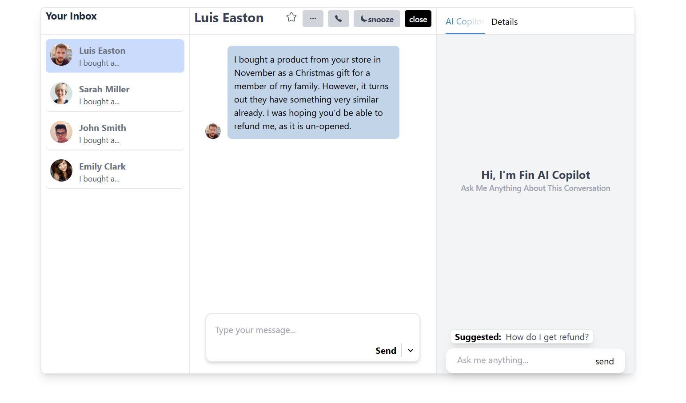
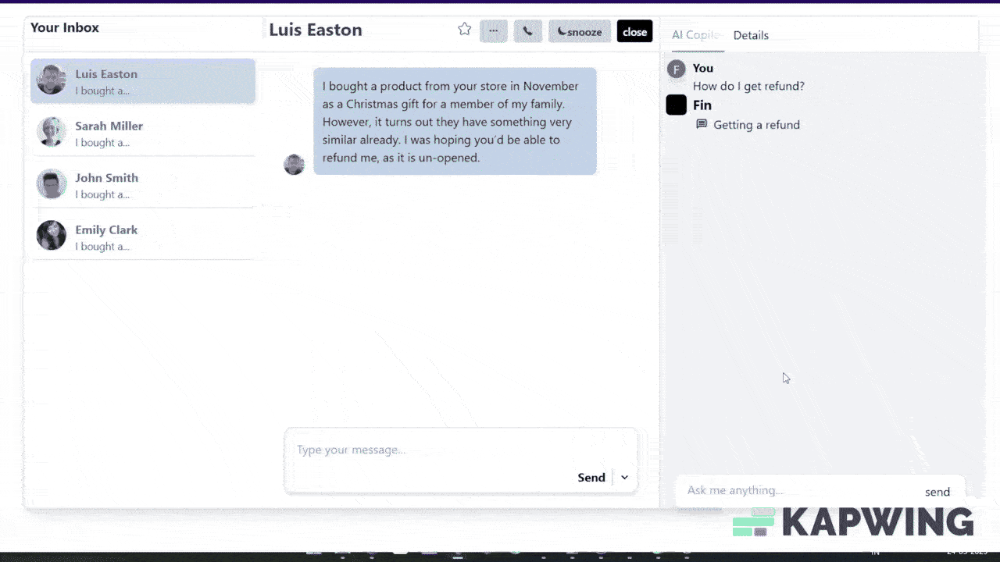
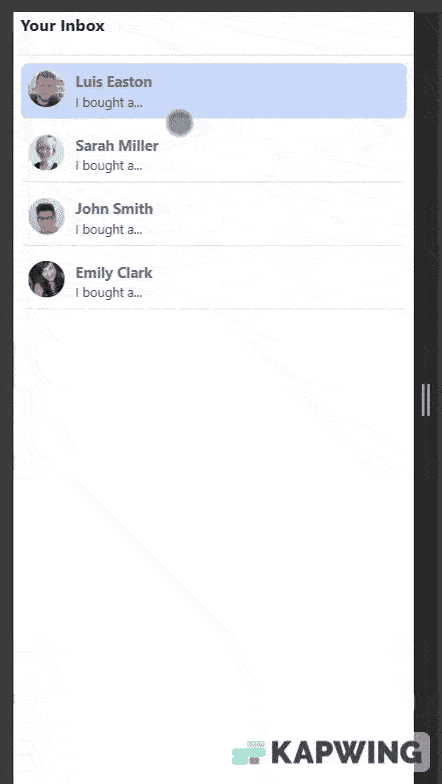
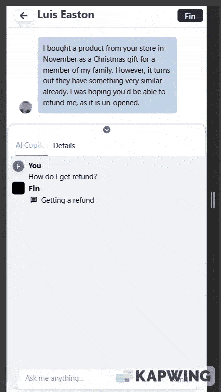

# Fin

This project is an AI-powered sidebar assistant built with React, TypeScript, and Vite. It features a modern UI inspired by productivity tools, with support for user assignment, team management, quick links, and expandable data sections. The design is fully responsive, providing a seamless experience on both desktop and mobile devices.

## Tech Stack

- **React** – UI library for building user interfaces
- **TypeScript** – Strongly typed JavaScript
- **Vite** – Fast frontend build tool
- **Tailwind CSS** – Utility-first CSS framework
- **React Router DOM** – Client-side routing
- **React Icons** – Icon library for React
- **Vercel** – Deployment and hosting

## Project Links

- **GitHub Repository:** [https://github.com/jitendrasinghmax/Fin](https://github.com/jitendrasinghmax/Fin)
- **Live Demo (Vercel):** [https://fin-seven.vercel.app/](https://fin-seven.vercel.app/)

## Screenshots

### Desktop Version

### Mobile Version

  
  

